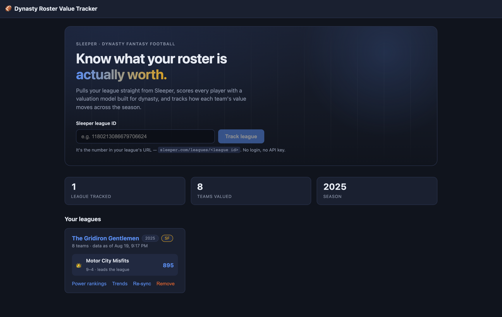
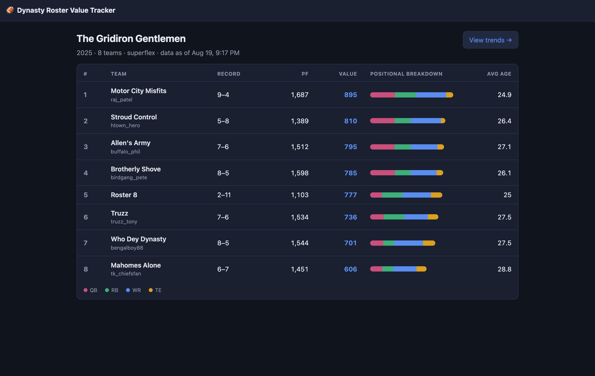
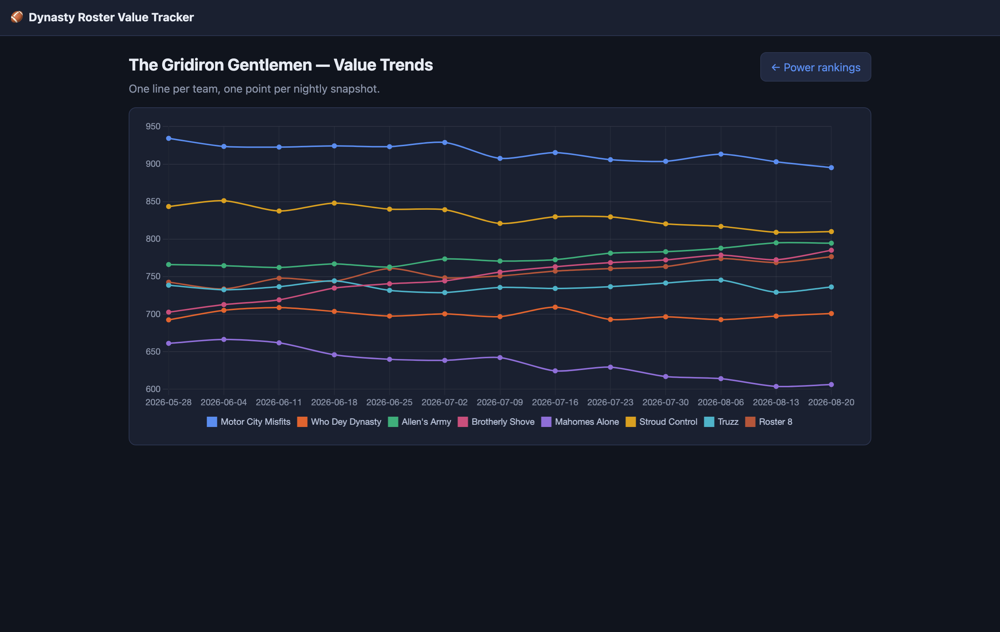

# Dynasty Roster Value Tracker


A Spring Boot service that pulls my dynasty fantasy league's rosters from the
[Sleeper API](https://docs.sleeper.com/), scores every player with a valuation model I wrote,
and snapshots each team's total roster value once a day. The Angular front end shows power
rankings and a line chart of how each team's value has moved over the season.

Sleeper doesn't publish trade values, so the scoring model is mine — and it's configurable
for different league formats (a QB is worth ~40% more in superflex).







## Quickstart

```
docker compose up
```

Then open http://localhost:4200, paste your Sleeper league ID (it's in the league URL:
`sleeper.com/leagues/<league id>`), and the first sync pulls everything in a few seconds.
No API keys needed — Sleeper's API is public and read-only.

If port 8080 or 4200 is already taken on your machine, override either one:

```
API_PORT=8081 WEB_PORT=4300 docker compose up
```

To try it without a real league, run it against the bundled fake Sleeper server and add
league ID `1264349217897840640`:

```
docker compose -f compose.yml -f compose.e2e.yml up --build
```

**Stack:** Java 21 · Spring Boot 3.3 · PostgreSQL 16 · Angular 18 · Docker Compose ·
JUnit 5 / Mockito / Testcontainers / Playwright

## How the valuation model works

```
value = base × ageFactor × positionWeight × injuryPenalty
```

- **base** — a decay curve over Sleeper's `search_rank` (their rough relevance ranking;
  lower = more valuable): `base = 100 × exp(-searchRank / 250)`. Rank 1 ≈ 99.6,
  rank 250 ≈ 36.8, rank 1000 ≈ 1.8. A null `search_rank` means Sleeper considers the
  player irrelevant, so it scores 0 — not rank 0.
- **ageFactor** — dynasty is about the future, so age matters more than in redraft.
  Each position gets its own aging curve, implemented as piecewise-linear interpolation
  over a lookup table in `application.yml`:

  | Position | Peak age | Factor at 22 | at peak | at 30 | at 34 |
  |---|---|---|---|---|---|
  | RB | 24 | 1.15 | 1.20 | 0.55 | 0.20 |
  | WR | 26 | 1.10 | 1.15 | 0.75 | 0.40 |
  | TE | 27 | 1.00 | 1.10 | 0.85 | 0.55 |
  | QB | 29 | 1.05 | 1.10 | 1.05 | 0.85 |

- **positionWeight** — league-format dependent. In a superflex league the QB weight jumps
  from 0.85 to 1.35; the app auto-detects superflex from the league's roster positions.
  Same code, different league format, one config change.
- **injuryPenalty** — IR/Out → 0.85, Questionable/Doubtful → 0.95, healthy → 1.0.

To be clear: this is a heuristic, not a market price. `search_rank` is the weakest link —
see "What I'd do next" below.

## Architecture

```
┌──────────────┐    HTTP/JSON    ┌──────────────────────────┐
│  Angular 18  │ ──────────────► │  Spring Boot API         │
│  (nginx)     │ ◄────────────── │  ┌────────────────────┐  │
└──────────────┘                 │  │ web/ controllers   │  │
                                 │  ├────────────────────┤  │
                                 │  │ service/           │  │
                                 │  │  LeagueSyncService │  │
                                 │  │  ValuationService  │  │
                                 │  │  SnapshotService   │  │
                                 │  ├────────────────────┤  │
                                 │  │ sleeper/ client    │──┼──► api.sleeper.app
                                 │  ├────────────────────┤  │
                                 │  │ repository/ (JPA)  │  │
                                 │  └────────────────────┘  │
                                 └───────────┬──────────────┘
                                             │
                                     ┌───────▼────────┐
                                     │  PostgreSQL 16 │
                                     └────────────────┘
        @Scheduled nightly job ──► LeagueSyncService ──► SnapshotService
```

Design decisions that mattered:

- **`ValuationService` is a pure function** — a `Player` and config in, a `BigDecimal` out,
  no I/O. Testing the interesting behavior doesn't need a database or a running server.
- **Sync never deletes on failure.** Everything is fetched into memory first, then written
  in one transaction. If Sleeper 500s halfway through, yesterday's rosters survive.
  Every sync is recorded in a `sync_log` table (RUNNING → SUCCESS/FAILED).
- **The player dump is cached.** `/players/nfl` is ~15MB (12k players) and Sleeper asks you to fetch it
  at most once a day, so it lives in Postgres with a freshness guard and is never fetched
  on a request path. Data can be up to 24h stale — the UI shows "data as of ..." instead
  of hiding it.
- **Snapshots are idempotent.** `UNIQUE (roster_id, captured_on)` means re-running a sync
  three times in one day updates one row instead of polluting the trend chart.
- Errors surface as RFC 7807 `ProblemDetail` responses via `@RestControllerAdvice` —
  an unknown league is a 404 with a message, not a stack trace.

## API

| Method | Path | Notes |
|---|---|---|
| `POST` | `/api/leagues` | Body `{"sleeperLeagueId": "..."}` → 201, runs the first sync |
| `GET` | `/api/leagues` | All tracked leagues |
| `GET` | `/api/leagues/{id}` | League detail + `lastSyncedAt` |
| `POST` | `/api/leagues/{id}/sync` | 202 Accepted, async re-sync |
| `GET` | `/api/leagues/{id}/rosters` | Power rankings, sorted by current total value |
| `GET` | `/api/rosters/{id}` | Roster detail with per-player value scores |
| `GET` | `/api/leagues/{id}/trends?from=&to=` | Value series per team for the chart |
| `DELETE` | `/api/leagues/{id}` | Stop tracking |

There are no user accounts — every tracked league is visible to anyone who can reach
the app. That's fine for running it yourself, but if you put it on a public URL, put
authentication in front of it. `MAX_LEAGUES` (default 25) caps how many leagues one
instance will track so a public deployment can't be filled up; going over returns 409.

Storage is modest: the player catalog is shared across leagues (~600 KB), and each
tracked league adds roughly 750 KB of daily snapshots per season.

A nightly job (4:15am ET) re-syncs every tracked league and captures a value snapshot
per roster.

## Tests

```
cd backend && mvn verify         # unit + web slice + Testcontainers Postgres
cd frontend && npm run e2e       # Playwright, against the compose stack
```

- Valuation model: age curve, superflex toggle, junk-data cases (pure JUnit, no Spring)
- Sync: snapshot idempotency and the failed-sync-deletes-nothing guarantee (Mockito)
- Sleeper client: parses a recorded roster fixture, including team-code defense entries
  and orphaned rosters with a null owner (`MockRestServiceServer`)
- Web: ranked JSON shape and 404 problem details (`@WebMvcTest`)
- Persistence: date-range query + unique constraint against **real Postgres 16 via
  Testcontainers** — H2 happily accepts SQL that Postgres rejects
- E2E: add league → rankings render → roster detail (Playwright against Docker Compose
  with a stubbed Sleeper in `tools/sleeper-stub`, so CI doesn't depend on a third party)

## Development

```
docker compose up db -d                  # just Postgres
cd backend && mvn spring-boot:run        # API on :8080
cd frontend && npm start                 # dev server on :4200, proxies /api
```

## What I'd do next

- Pull real market values from a second source (KeepTradeCut or FantasyCalc) and backtest
  the model against them — `search_rank` is a popularity proxy, not a price.
- Taxi squad / draft pick valuation, which dynasty managers actually trade around.
- Auth + multi-user so it's not just my leagues. Deliberately out of scope for v1.
